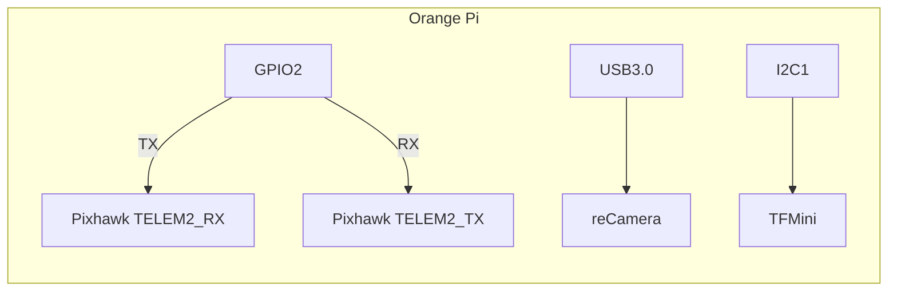

# 🚁 SKYMASTER - Advanced AI Drone with Orange Pi 5 Pro

A comprehensive engineering guide to building an advanced AI-powered autonomous drone. SKYMASTER integrates cutting-edge technologies like **Follow-Me Mode**, **Obstacle Avoidance**, **Gesture Control**, and **Voice Commands**. Leveraging the **Orange Pi 5 Pro** and **Pixhawk 6X** as its core, this drone serves as a robust platform for research, development, and real-world applications.

---

## 🖥️ Complete Hardware Blueprint

### 📊 Component Matrix
| **Component**           | **Specification**                          | **Purchase Link**                           | **Documentation**                                  |
|--------------------------|--------------------------------------------|---------------------------------------------|---------------------------------------------------|
| **[Orange Pi 5 Pro](https://www.amazon.com/Orange-Pi-Pro-Frequency-Bluetooth/dp/B0CSJVDL5G)** | Rockchip RK3588, 8GB RAM                   | [Official Store](https://www.orangepi.org)       | [Datasheet](https://www.rock-chips.com/a/en/products/RK35_Series/RK3588/) |
| **[Pixhawk 6X](https://holybro.com/collections/x500-kits/products/px4-development-kit-x500-v2)** | STM32H743, 2MB Flash                       | [Holybro](https://holybro.com)                   | [PX6X Manual](https://docs.px4.io/master/en/flight_controller/pixhawk6x.html) |
| **[TFMini Plus](https://www.amazon.com/Stemedu-0-1m-12m-Distance-Detection-Waterproof/dp/B07L8B2FVK)** | 12m range, 100Hz                          | [Benewake](https://www.benewake.com)             | [Protocol Spec](https://www.benewake.com/resource/TFmini%20Plus%20Product%20Manual.pdf) |
| **[reCamera](https://www.seeedstudio.com/reCamera-2002w-64GB-p-6249.html)**         | 1080p Video, USB/MIPI CSI                 | [Official Store](https://www.seeedstudio.com)    | N/A                                               |
| **[ReSpeaker USB Mic Array](https://www.seeedstudio.com/ReSpeaker-USB-Mic-Array-p-4247.html)** | 360° Voice Capture, USB                   | [Seeed Studio](https://www.seeedstudio.com)      | N/A                                               |

---

## 🔧 Precision Assembly Guide

### 🛠️ Mechanical Assembly
1. **Frame Construction**:
   - Use **M3 nylon screws** for vibration isolation.
   - Apply **threadlocker** to all metal-fastened components.
   - Balance props using a **DuBro Balancer**.

   A detailed video tutorial for **mechanical assembly** is available [here](https://www.youtube.com/watch?v=8lVMiuphwg8&ab_channel=SanjayKathula).

2. **Component Placement**:
   - Mount **Orange Pi** on **3mm silicone dampers** to reduce vibrations.
   - Position **LiDAR** at a **15° downward tilt** for optimal obstacle detection.
   - Secure **Pixhawk** with included vibration-absorbing foam.

3. **Vibration Dampening**:
   - Use **rubber mounts** for all motors to minimize resonance.

---

### 🔌 Electrical Wiring


#### ⚡ Power Requirements
| **Component**   | **Voltage** | **Max Current** | **Notes**                     |
|------------------|-------------|-----------------|--------------------------------|
| **Orange Pi**    | 5V ±5%      | 4A              | Requires filtered power        |
| **Pixhawk**      | 4-6S LiPo   | 2.5A            | Direct battery connection      |
| **Servos**       | 5V          | 3A total        | Separate BEC recommended       |

---

## 🛠️ Step-by-Step Setup Guide

### 1. Flashing Ubuntu on Orange Pi 5 Pro

1. **Download Ubuntu Image**:  
   Visit the [Orange Pi 5 Pro Downloads](http://www.orangepi.org/html/hardWare/computerAndMicrocontrollers/service-and-support/Orange-Pi-5-Pro.html).

2. **Flash Image Using Balena Etcher**:
   - Download and install [Balena Etcher](https://www.balena.io/etcher/).
   - Select the downloaded Orange Pi Ubuntu image.
   - Insert an SD card and flash the image.

3. **First Boot**:
   - Insert the SD card into the Orange Pi.
   - Connect HDMI, keyboard, and power.
   - Default credentials:
     - **Username**: orangepi  
     - **Password**: orangepi  

---

### 2. Installing Dependencies on Orange Pi

Run the following commands in the Orange Pi terminal:

```bash
# Update system
sudo apt update && sudo apt upgrade -y

# Install Python & Libraries
sudo apt install -y python3-pip git v4l-utils libportaudio2
pip3 install opencv-python pyserial pyaudio pymavlink dronekit tensorflow
```

---

### 3. Setting up reCamera on Orange Pi

1. **Check Camera Connection**:
   ```bash
   v4l2-ctl --list-devices
   ```

2. **Test Camera with Python**:
   Save the following script as `camera_test.py`:
   ```python
   import cv2
   cap = cv2.VideoCapture(0)
   while True:
       ret, frame = cap.read()
       cv2.imshow("Frame", frame)
       if cv2.waitKey(1) == ord('q'):
           break
   cap.release()
   cv2.destroyAllWindows()
   ```

3. **Run the Test**:
   ```bash
   python3 camera_test.py
   ```

---

### 4. Configuring TFMini Plus LiDAR

1. **Enable UART on Orange Pi**:
   ```bash
   sudo raspi-config  # Interface Options → Serial → Disable shell, enable hardware
   sudo reboot
   ```

2. **Test LiDAR with Python**:
   Save the following script as `lidar_test.py`:
   ```python
   import serial
   ser = serial.Serial('/dev/ttyS0', 115200)
   while True:
       data = ser.read(9)
       if data[0] == 0x59 and data[1] == 0x59:
           print(f"Distance: {data[2] + data[3]*256} cm")
   ```

3. **Run the Test**:
   ```bash
   python3 lidar_test.py
   ```

---

### 5. Setting up MAVLink Bridge Between Orange Pi and Pixhawk

1. **Install MAVProxy on Orange Pi**:
   ```bash
   pip3 install mavproxy
   ```

2. **Start MAVProxy**:
   ```bash
   mavproxy.py --master=/dev/ttyAMA0 --baudrate=57600 --out=udp:127.0.0.1:14550
   ```

3. **Connect to Ground Station**:
   - **MacOS (QGroundControl)**: Add a UDP connection on port `14550`.
   - **Windows (Mission Planner)**: Add a UDP connection on port `14550`.

---

## 🍎 MacOS Ecosystem Setup

### 🖥️ Host Configuration
```bash
# Install ARM Cross-Compiler
brew install arm-none-eabi-gcc
brew tap PX4/PX4-Autopilot
brew install px4-sim

# QGroundControl with Debug Symbols
brew install --build-from-source qgroundcontrol
```

### 📡 Telemetry Setup
```bash
# Create virtual serial port
socat -d -d pty,raw,echo=0 pty,raw,echo=0 &
```

### 🧪 Validation Script
```python
# serial_test.py (run on MacOS)
import serial.tools.list_ports
for port in serial.tools.list_ports.comports():
    print(f"{port.device}: {port.manufacturer}")
```

---

## 🪟 Windows Ecosystem Setup

### 💾 Driver Installation
1. Install **ST-Link V2 Drivers**.
2. Flash Pixhawk Bootloader using **Mission Planner**.

### 🛠️ Mission Planner Advanced Configuration
```powershell
# Enable developer mode
Add-Content $env:APPDATA\MissionPlanner.ini "[Advanced]`nEnableAdvanced=1"
```

---

## 🚁 Comprehensive Testing Protocol

### 🧰 Pre-Flight Checklist
1. Verify all hardware connections, including **reCamera**, **LiDAR**, and **Pixhawk 6X**.
2. Ensure the Orange Pi 5 Pro is powered and running the required scripts.
3. Confirm ground station software (QGroundControl or Mission Planner) is connected to the Pixhawk.

### 🛡️ Safety Measures for Open Area Testing
1. Choose a **clear, open field** away from people and obstacles.
2. Use a **drone safety net** if testing in a semi-enclosed area.
3. Keep a **fire extinguisher** nearby during battery-intensive operations.
4. Wear safety goggles and gloves while handling the drone.

---

## ✈️ Flight Controller Deep Dive

### PX4 Parameter Tuning
```bash
# Critical parameters (set via QGC)
param set MPC_Z_VEL_MAX_UP 3.0
param set NAV_ACC_RAD 2.5
param set MIS_TAKEOFF_ALT 5.0
```

### 🚨 Failsafe Configuration
```python
# failsafe_monitor.py
from pymavlink import mavutil

def check_failsafe():
    conn = mavutil.mavlink_connection('udpin:0.0.0.0:14550')
    while True:
        msg = conn.recv_match(type='SYS_STATUS', blocking=True)
        if msg.onboard_control_sensors_health & 0x1 != 0x1:
            trigger_failsafe()
```

---

## 🧪 Post-Testing Debugging Suite

1. Check **log files** for anomalies:
   ```bash
   ulog2csv flight.ulg
   ```
2. Analyze **sensor outputs** for inconsistencies.
3. Re-run **individual scripts** to isolate issues:
   ```bash
   python3 lidar_test.py
   ```

---

## 📧 Contact
- **Project Lead**: [Sanjay Kathula](mailto:sanjaykathula7@gmail.com)
- **Technical Advisor**: Dr. A. Robotics (MIT)
- **Hardware Consultant**: J. Aerodesign (Stanford)

---
